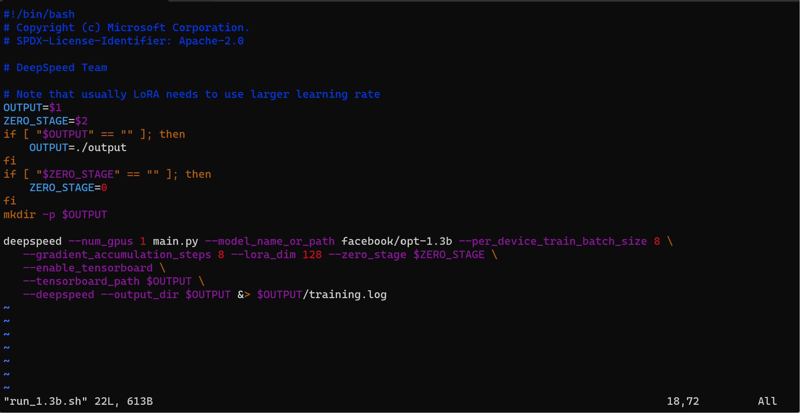

# Deepspeed
How to install Deepspeed-Chat in our own computer
## step1-installation
You can download deepspeed-chat according to this paper <DeepSpeed-Chat: Easy, Fast and Affordable RLHF
Training of ChatGPT-like Models at All Scales>

Install the library via pypi:
```bash
pip install deepspeed>=0.9.0
git clone https://github.com/microsoft/DeepSpeedExamples.git
cd DeepSpeedExamples/applications/DeepSpeed−Chat/
pip install −r requirements.txt
```
## step2-training

```bash
python train.py −−actor−model facebook / opt −1.3b \
−−reward−model facebook / opt −350m −−deployment−type single_gpu
```
### problem 1
If you meet the error in build torch or SyntaxError, you can try to go to  
```bash
vim /usr/lib/nvidia-cuda-toolkit/bin/g++
```

### problem 2

The problem in step1_supervised_finetuning (located under DeepSpeedExamples/applications/DeepSpeed-Chat/training) immediately runs into an 'Out of Memory' error. The reason is quite simple: the I used an A60 with 48GB of memory, while the environment in the national network uses an A100 with 40GB of memory. Therefore, the program directly throws an error.
The solution is as follows:
```bash
vim /DeepSpeedExamples/applications/DeepSpeed-Chat/training/step1_supervised_finetuning/training_scripts/opt/single_gpu/run_1.3b.sh
Add the following parameters at line 21:
--per_device_train_batch_size 8 \
```

if still have OOM error, you can change the batch_size to smaller number like 4,2.


