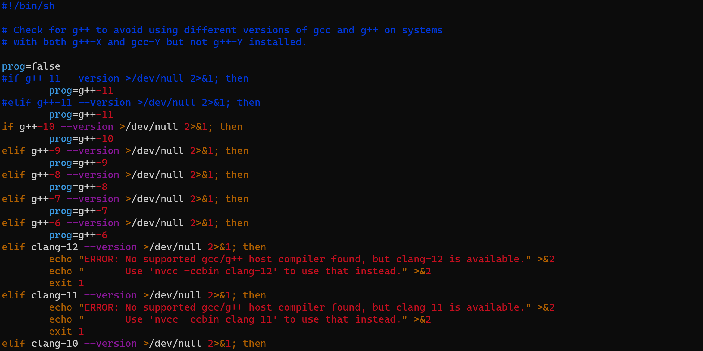
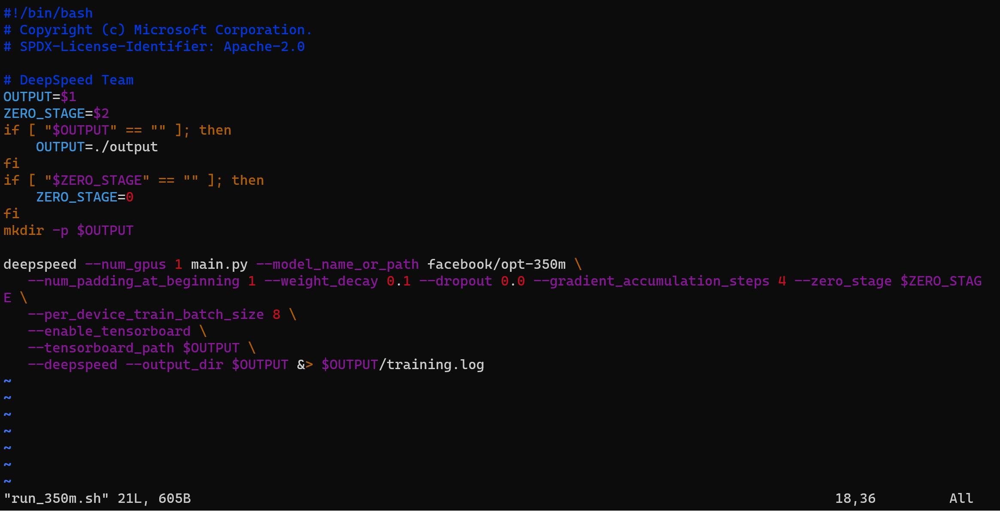
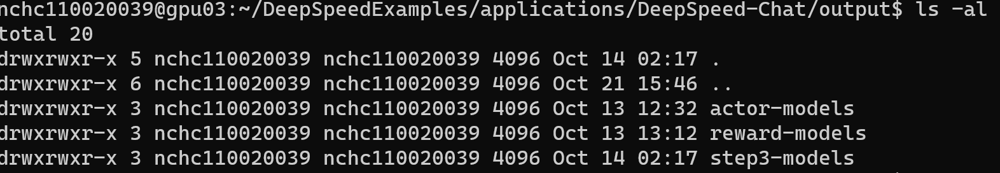
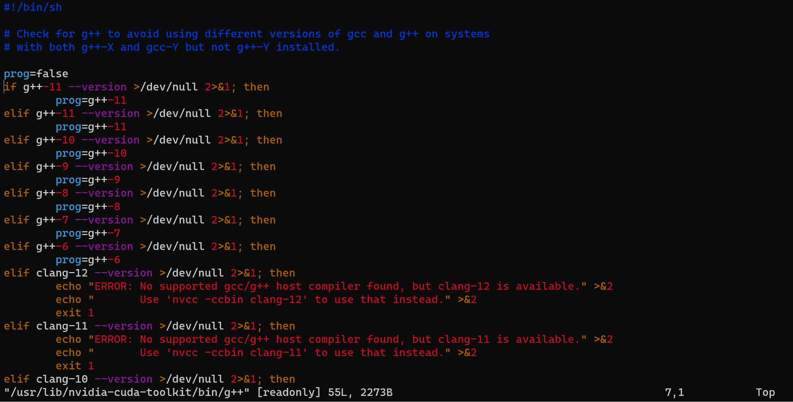

# Deepspeed
How to install Deepspeed-Chat in our own computer
## step1-installation
You can download deepspeed-chat according to this paper <DeepSpeed-Chat: Easy, Fast and Affordable RLHF
Training of ChatGPT-like Models at All Scales>

Install the library via pypi:
```bash
pip install deepspeed>=0.9.0
git clone https://github.com/microsoft/DeepSpeedExamples.git
cd DeepSpeedExamples/applications/DeepSpeed−Chat/
pip install −r requirements.txt
```
## step2-training

```bash
python train.py −−actor−model facebook / opt −1.3b \
−−reward−model facebook / opt −350m −−deployment−type single_gpu
```
### problem 1
If you meet the error in build torch or SyntaxError, you can check the gcc version,
```bash
gcc --version
```
if it shows gcc version is 11.xx we need to change the version, comment g++-11 version.
```bash
vim /usr/lib/nvidia-cuda-toolkit/bin/g++
```

### problem 2

The problem in step1_supervised_finetuning (located under DeepSpeedExamples/applications/DeepSpeed-Chat/training) immediately runs into an 'Out of Memory' error. The reason is quite simple: the I used an A60 with 48GB of memory, while the environment in the national network uses an A100 with 40GB of memory. Therefore, the program directly throws an error.
The solution is as follows:
```bash
vim /DeepSpeedExamples/applications/DeepSpeed-Chat/training/step1_supervised_finetuning/training_scripts/opt/single_gpu/run_1.3b.sh
Add the following parameters :
--per_device_train_batch_size 8 \
```

if still have OOM error, you can change the batch_size to smaller number

### problem 3
The problem in step2_reward_model_finetuning immediately runs into an "OOM" error.
```bash
vim /DeepSpeedExamples/applications/DeepSpeed-Chat/training/step2_reward_model_finetuning/training_scripts/opt/single_gpu/run_1.3b.sh
Add the following parameters :
--per_device_train_batch_size 8 \
```

if still have OOM error, you can change the batch_size to smaller number

### problem 4
Deepspeed version issue, we need to install version 0.10.0
```bash
pip install deepspeed===0.10.0
```
after few hour of training you will get


## more training
If you wanna start talking with you chat-GPT like model 
```bash
cd /DeepSpeedExamples/applications/DeepSpeed-Chat/
nohup python3 train.py --step 3 --actor-model facebook/opt-1.3b --reward-model facebook/opt-350m --deployment-type single_node > train.log 2>&1 &
```
### problem 1
Before we have change gcc version to 10.xx, now we need to change it back to version 11.xx because the 
```bash
vim /usr/lib/nvidia-cuda-toolkit/bin/g++
```

### problem 2
Cuda's version need to be cuda

## running
```bash
python3 chat.py --path output/step3-models/1.3b/actor
```
## reference
```bash
https://hackmd.io/pER__S14RgCFgFCqSfiQhw
https://github.com/microsoft/DeepSpeedExamples/blob/master/applications/DeepSpeed-Chat/README.md
https://github.com/microsoft/DeepSpeed/blob/master/blogs/deepspeed-chat/README.md
```


